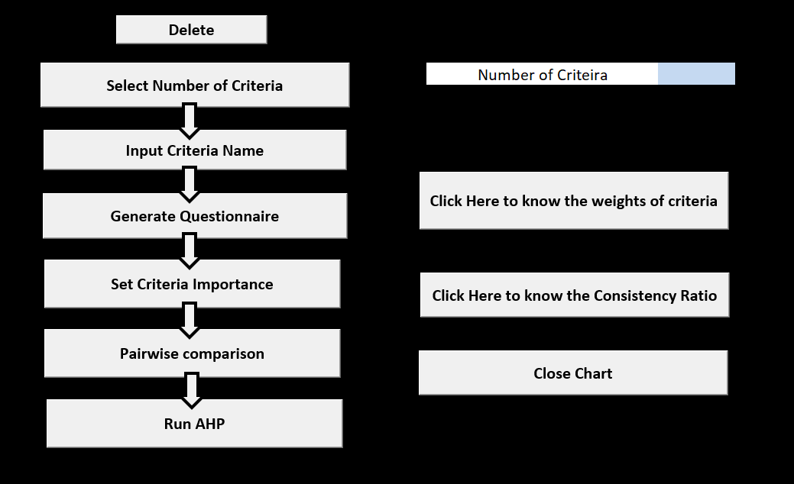

# AHP Excel Template

## Overview
This repository contains an Excel-based template for implementing the **Analytic Hierarchy Process (AHP)**. The file, `AHP.xlsm`, is a macro-enabled workbook designed to facilitate multi-criteria decision-making by using the AHP methodology.

The exported `.bas` files in this repository represent the VBA (Visual Basic for Applications) code modules used in the workbook.
---
## Home Screen

The home screen of the AHP Excel template provides a user-friendly interface with clickable buttons to perform various tasks in the AHP process. 

### Features of the Home Screen
1. **Select Number of Criteria**: 
   - Define the number of criteria for the decision-making process.
   - Currently, the user can select up to a maximum of **5 criteria**.

2. **Input Criteria Name**: 
   - Enter names for each of the selected criteria.

3. **Generate Questionnaire**: 
   - It Automatically create a pairwise comparison questionnaire and Criteria importance based on the selected criteria.

4. **Set Criteria Importance**: 
   - Assign importance levels to each criterion through the questionnaire.

5. **Pairwise Comparison**: 
   - Perform pairwise comparisons between criteria to determine relative importance.

6. **Run AHP**: 
   - Execute the AHP calculations and stores the results, including weights and consistency ratios.

7. **Consistency Checks**:
   - **Click to Know the Weights of Criteria**: Displays the calculated weights for each criterion in pie chart.
   - **Click to Know the Consistency Ratio**: Display the consistency ratio in percentage.

8. **Close Chart**: 
   - Exits any open charts or visual outputs from the AHP results.

These features guide users step-by-step through the AHP process, making it intuitive and efficient for decision-making tasks.

---

## Development Status
This project is currently **under development**. Features and functionality are being actively worked on and will be updated periodically. Contributions and feedback are welcome!

---

## How to Use
1. **Download the Repository:**
   - Clone or download this repository to your local machine.

2. **Open the Excel File:**
   - Open `AHP.xlsm` in Microsoft Excel.

3. **Enable Macros:**
   - Ensure macros are enabled to use the automated features.

---

## Requirements
- **Microsoft Excel 2016 or later**
  - Earlier versions may work but are not guaranteed to support all features.
- **Macros Enabled:**
  - Make sure macros are enabled for the workbook to function correctly.

